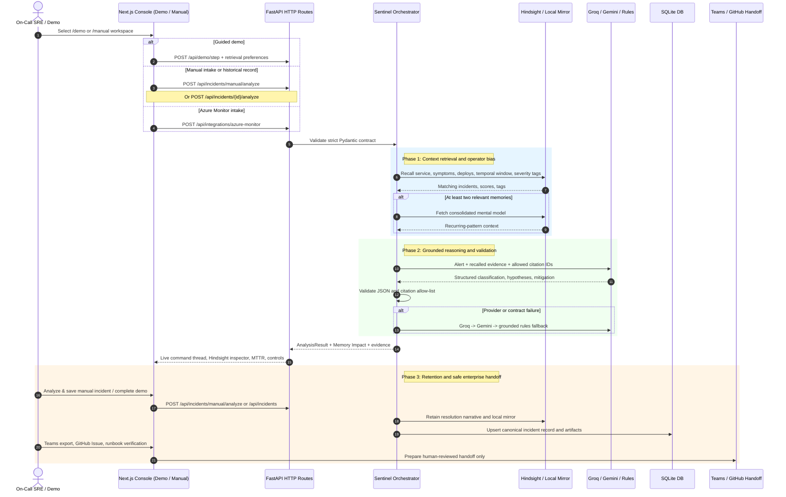
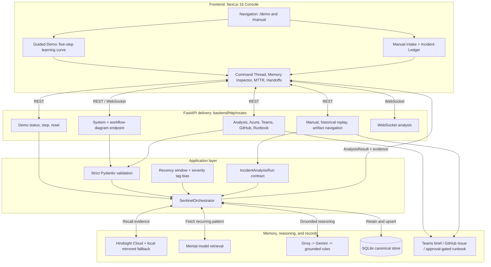

# Sentinel Workflow Diagrams

These Mermaid diagrams are the reviewer-readable counterpart to the API endpoint:

```text
GET /api/architecture/workflow
```

The endpoint is the runtime source for tools; this document is the stable, rendered
review reference.

## End-to-end operator sequence



## System architecture



## Design boundaries

- Hindsight retrieves and ranks memory; it is not replaced by UI filters.
- The analyzer may cite only IDs returned by current recall.
- Manual analysis happens before the newly submitted record is retained, avoiding
  self-citation.
- SQLite is the canonical record; Hindsight is the semantic recall layer.
- External controls prepare a reviewed handoff. They do not execute production
  commands, create GitHub issues, or post to Teams automatically.
